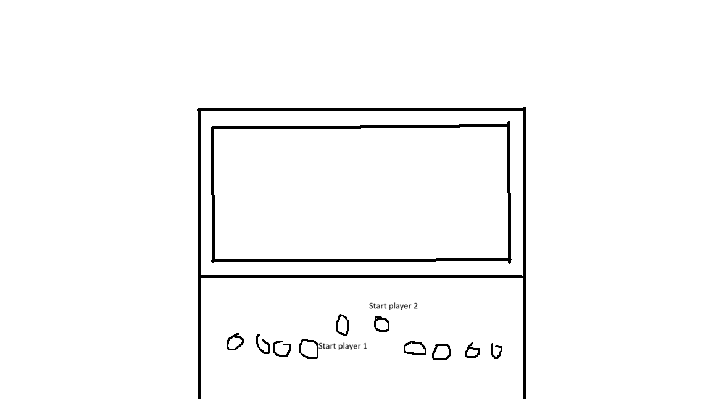
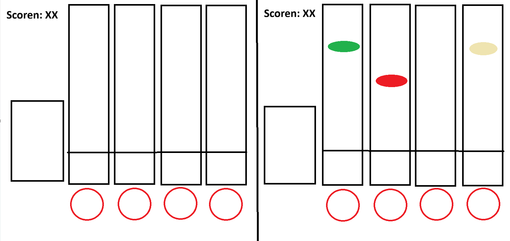

## Dingen die wij gebruiken: 
8x Arcade knoppen; 4 knoppen per speler.  
1x Raspberry Pi 5  
(rest moet door de rest nog ingevuld worden)  

# (Useful) Sources: 
https://www.instructables.com/Plug-and-Play-Arcade-Buttons/  
https://learn.adafruit.com/adafruit-led-arcade-button-qt/arduino  
 
# Controller concept:
  

# game concept:
  