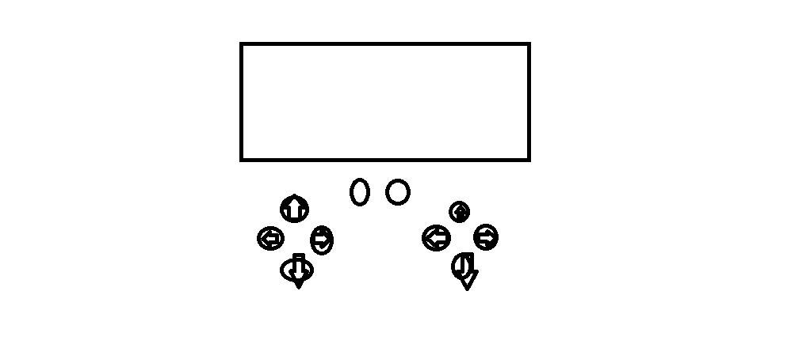

## Benodigheden:
1x HID capable microcontroller (there are a few like Arduino micro, Due & leonardo, I'll be using the Arduino Leonardo)

1x USB to arduino cable (for the Leonardo it's USB micro)

3x Arcade buttons (I bought these)

1x solderless breadboard

3x 10k ohm resistors

3x 220 ohm resistors

Jumper wires


# Source code:
```
#include "Keyboard.h"<br>
const int buttonLeft = A0;          // input pin for pushbutton
const int buttonRight = A1;
const int buttonUp = A2;
void setup() {
  // make the pushButton pin an input:
  pinMode(buttonLeft, INPUT);
  pinMode(buttonRight, INPUT);
  pinMode(buttonUp, INPUT);
  // initialize control over the keyboard:
  Keyboard.begin();
}
void loop() {
  // read the pushbutton:
  int buttonStateLeft = digitalRead(buttonLeft);
  if (buttonStateLeft == HIGH) //if the button is pressed
  {
    // type out a message
    Keyboard.print("a");
    delay(50); //Delay for bounce & to let you computer catch up
  }
  // read the pushbutton:
  int buttonStateRight = digitalRead(buttonRight);
  if (buttonStateRight == HIGH) //if the button is pressed
  {
    // type out a message
    Keyboard.print("w");
    delay(50); //Delay for bounce & to let you computer catch up
  }
  // read the pushbutton:
  int buttonStateUp = digitalRead(buttonUp);
  if (buttonStateUp == HIGH) //if the button is pressed
  {
    // type out a message
    Keyboard.print("d");
        delay(50); //Delay for bounce & to let you computer catch up
  }
}
```

```
#include "Keyboard.h"<br>
const int buttonLeft = A0;          // input pin for pushbutton
const int buttonRight = A1;
const int buttonUp = A2;
int previousButtonStateLeft = HIGH;   // for checking the state of a pushButton
int previousButtonStateRight = HIGH;  
int previousButtonStateUp = HIGH;  
void setup() {
  // make the pushButton pin an input:
  pinMode(buttonLeft, INPUT);
  pinMode(buttonRight, INPUT);
  pinMode(buttonUp, INPUT);
  // initialize control over the keyboard:
  Keyboard.begin();
}
void loop() {
  // read the pushbutton:
  int buttonStateLeft = digitalRead(buttonLeft);
  // if the button state has changed,
  if ((buttonStateLeft != previousButtonStateLeft)
      // and it's currently pressed:
      && (buttonStateLeft == HIGH)) {
    // type out a message
    Keyboard.print("a");
  }
  // save the current button state for comparison next time:
  previousButtonStateLeft = buttonStateLeft;
  // read the pushbutton:
  int buttonStateRight = digitalRead(buttonRight);
  // if the button state has changed,
  if ((buttonStateRight != previousButtonStateRight)
      // and it's currently pressed:
      && (buttonStateRight == HIGH)) {
    // type out a message
    Keyboard.print("w");
  }
  // save the current button state for comparison next time:
  previousButtonStateRight = buttonStateRight;
  // read the pushbutton:
  int buttonStateUp = digitalRead(buttonUp);
  // if the button state has changed,
  if ((buttonStateUp != previousButtonStateUp)
      // and it's currently pressed:
      && (buttonStateUp == HIGH)) {
    // type out a message
    Keyboard.print("d");
  }
  // save the current button state for comparison next time:
  previousButtonStateUp = buttonStateUp;
}
```


# (Useful) Sources: 
https://www.instructables.com/Plug-and-Play-Arcade-Buttons/
https://learn.adafruit.com/adafruit-led-arcade-button-qt/arduino

# Controller concept:


# game concept:
