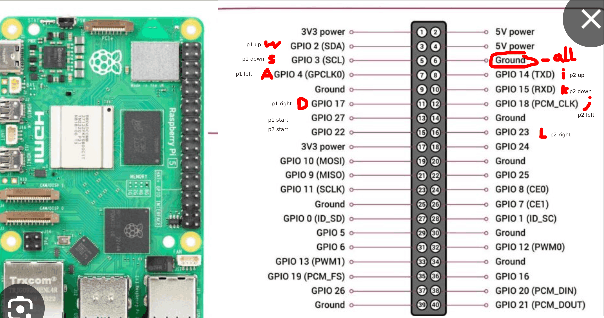
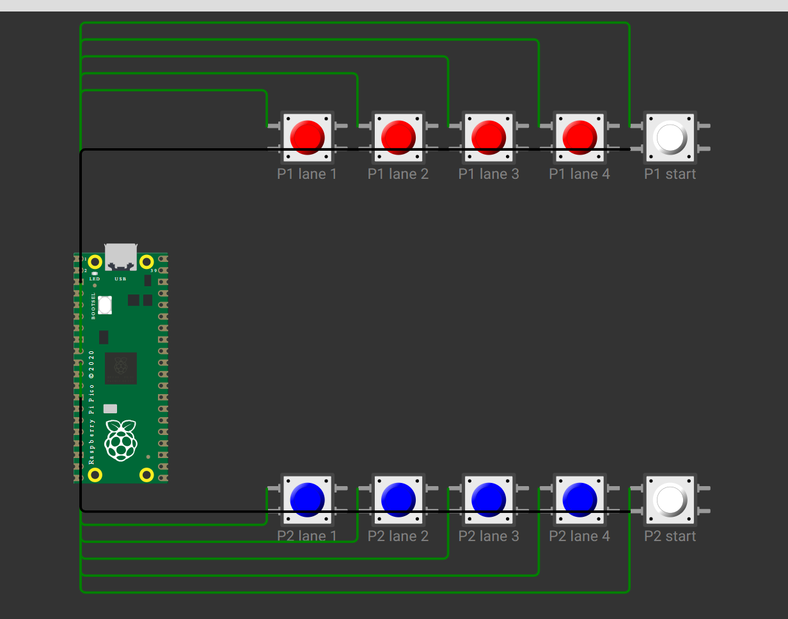

## Wat het moet worden:
De controller word 1 gamepad met 10 knoppen totaal. </br>
4 knoppen per speler, 2 start knoppen per speler. 

## Onderdelen:
1x Raspberry Pi 5 </br>
8x Arcade knop; 4 per speler </br>
2x Arcade knop om te starten </br>

## Aansluiten:


Enige aanpassing, Pico > Pi5, p1 en p2 start krijgen hun eigen gnd en gpio serie

# Firmware
wrs gaan we een service maken die bij boot the gpio pins opsteld en de controller blijft rennen. <br> 
En daarna de game start

## Testen: 
```
Python3 test_button.py
Button Clicked!
```